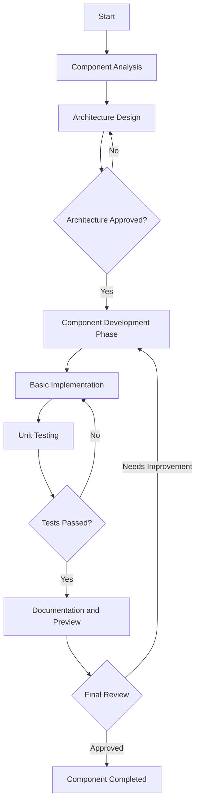
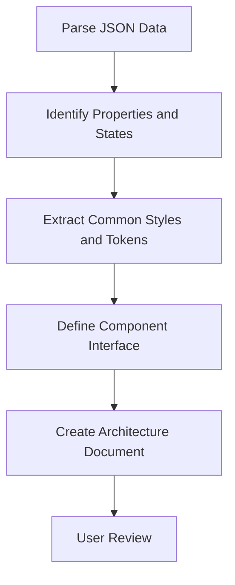
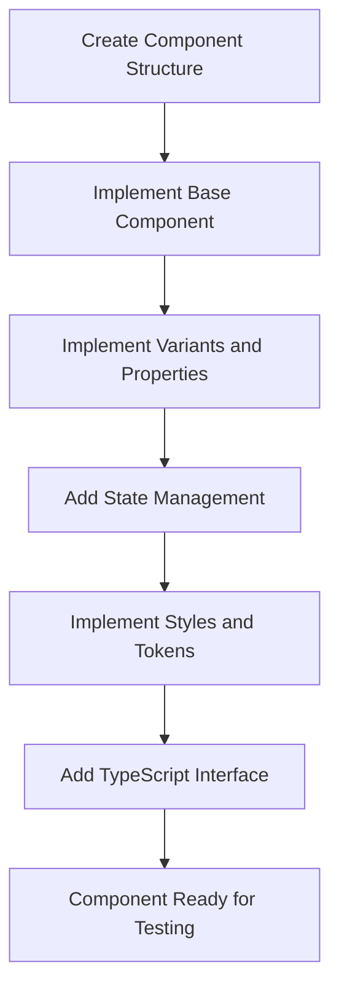
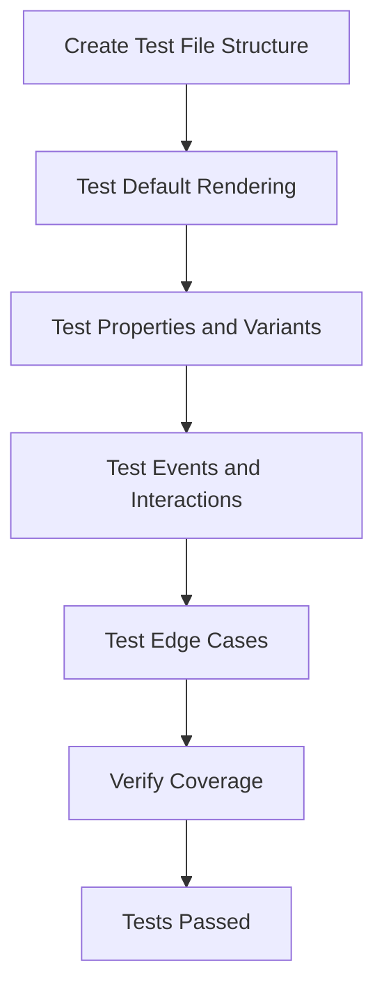
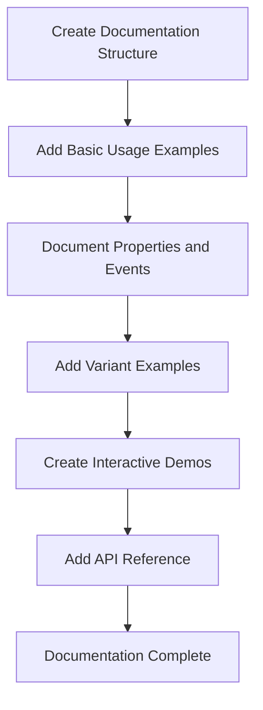

# Component Development Workflow

## Component-Driven Development Cycle



## 1. Component Analysis and Architecture

**Input**: Component JSON Specification  
**Output**: Architecture Document (`architecture/${componentName}-arch.md`)



**Checklist**:

- [ ] Property analysis completed
- [ ] States and variants identified
- [ ] Common styles extracted
- [ ] Component interface defined
- [ ] Architecture document approved

## 2. Component Development

**Input**: Approved Architecture Document  
**Output**: Functional Component (`src/components/${componentName}/`)



**Files to Create**:

- `src/components/${componentName}/index.ts` (exports)
- `src/components/${componentName}/types.ts` (interfaces and types)
- `src/components/${componentName}/${componentName}.vue` (component)

## 2.1 UI Interaction Design Guidelines

During component development, the design principles defined in `architecture/ui-interaction-design.md` must be strictly followed. Particularly the following points:

### State Management Strategy

Use the **Hybrid Strategy—CSS Pseudo-classes First, JavaScript as Supplement** approach for component state management:

1. **CSS First Principle**: For basic states like hover and focus, prioritize CSS pseudo-classes
2. **State Extension Principle**: Allow overriding or extending default state behavior through props
3. **Consistency Principle**: Maintain consistent state management patterns across the component library
4. **Performance First Principle**: Minimize unnecessary JavaScript state management

### Component Reuse Principles

1. **Component Reuse Priority**: If new functionality can be implemented through reusing or combining existing components, prioritize reuse
2. **Consistency Assurance**: Ensure design and interaction experience consistency through component reuse
3. **Maintenance Efficiency**: Reduce duplicate code, improve maintenance efficiency and scalability
4. **Performance Considerations**: Ensure reuse doesn't introduce unnecessary performance overhead

**State Management Validation Checklist**:

- [ ] All common states (hover, focus, active) primarily implemented using CSS pseudo-classes
- [ ] Component supports overriding default states via props
- [ ] All necessary mouse and keyboard interactions have appropriate state feedback
- [ ] State changes properly prevented in disabled state
- [ ] Component states behave consistently under various conditions

## 3. Testing and Validation

**Input**: Component Implementation  
**Output**: Validated Component and Tests



**Files to Create**:

- `__tests__/components/${componentName}/${componentName}.test.ts`

## 4. Documentation and Showcase

**Input**: Validated Component  
**Output**: Documentation and Live Examples



**Files to Create**:

- `docs/components/${componentName.toLowerCase()}.md`

## Implementation Guide

### Step 1: Create Task Document (Automated)

Based on the architecture document, generate a clear task list with specific subtasks:

```markdown
# ${ComponentName} Component Tasks

## 1. Component Structure

- [ ] Create component directory
- [ ] Create index.ts export file
- [ ] Create types.ts for TypeScript interfaces
- [ ] Create base component file

## 2. Component Implementation

- [ ] Implement base component structure
- [ ] Add properties and default values
- [ ] Implement state management (following UI interaction design guidelines)
- [ ] Add variant styles

## 3. Testing

- [ ] Create test file structure
- [ ] Test default rendering
- [ ] Test properties and variants
- [ ] Test events and interactions

## 4. Documentation

- [ ] Create documentation file
- [ ] Add usage examples
- [ ] Document properties and events
- [ ] Add interactive demos
```

### Step 2: Development Checkpoints

Implement clear checkpoints for each major section:

1. **Component Structure Checkpoint**

   - All required files created
   - Basic exports working
   - TypeScript interfaces defined

2. **Implementation Checkpoint**

   - Component renders correctly
   - All properties work as expected
   - State management functions according to UI interaction design guidelines
   - Styles applied correctly

3. **Testing Checkpoint**

   - All tests pass
   - Edge cases covered
   - No regressions

4. **Documentation Checkpoint**
   - All functionality documented
   - Examples available
   - API reference complete

### Step 3: Simplified Validation

Run simple validation steps after each major checkpoint:

```bash
# After component structure
pnpm run typecheck

# After implementation
pnpm run build

# After testing
pnpm run test

# After documentation
pnpm run docs:dev
```

## Simplified Workflow Visualization

```
┌─── Analysis ────┐  ┌─── Development ─┐  ┌─── Validation ──┐  ┌─── Docs ────────┐
│                 │  │                 │  │                 │  │                 │
│  Parse JSON     │  │  Create Files   │  │  Write Tests    │  │  Usage Guide    │
│  Extract Styles │  │  Add Props      │  │  Test Props     │  │  API Reference  │
│  Define Props   │  │  Implement      │  │  Test Events    │  │  Examples       │
│  Arch Design    │──►  Add States     │──►  Validate Styles│──►  Interactive    │
│                 │  │  Styling        │  │                 │  │  Demos          │
└─────────────────┘  └─────────────────┘  └─────────────────┘  └─────────────────┘
        ▲                                          │                    │
        └──────────────────────────────────────────┴────────────────────┘
                              Feedback Loop
```
