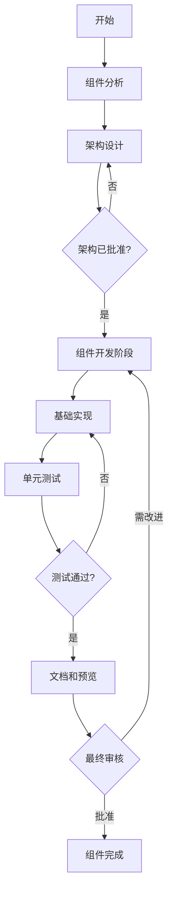
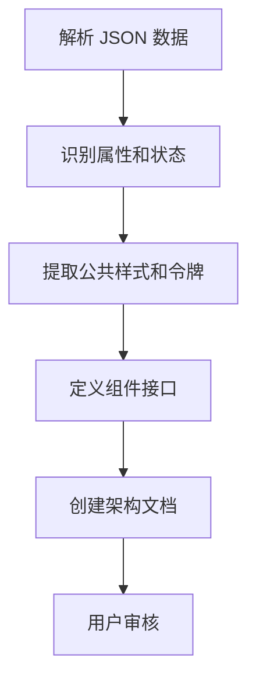
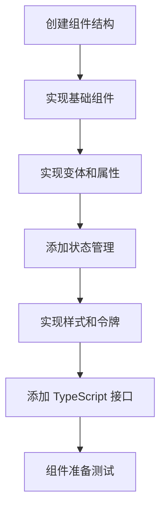
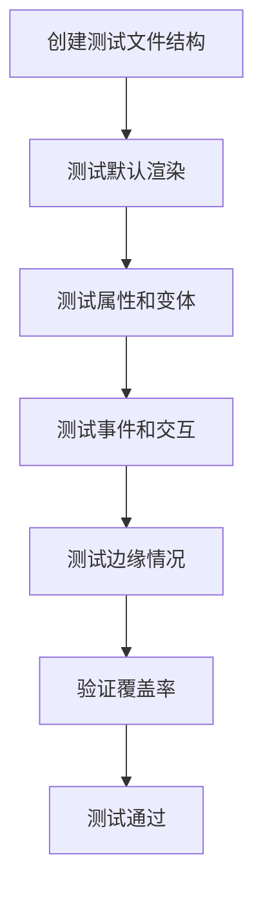
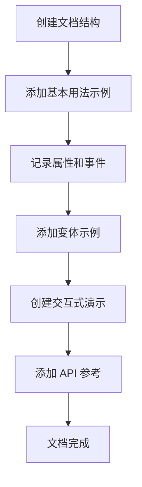

# 组件开发工作流程

## 组件驱动的开发周期



## 1. 组件分析与架构

**输入**: 组件 JSON 规格  
**输出**: 架构文档 (`architecture/${componentName}-arch.md`)



**检查清单**:

- [ ] 属性分析完成
- [ ] 状态和变体已识别
- [ ] 公共样式已提取
- [ ] 组件接口已定义
- [ ] 架构文档已批准

## 2. 组件开发

**输入**: 已批准的架构文档  
**输出**: 功能性组件 (`src/components/${componentName}/`)



**需要创建的文件**:

- `src/components/${componentName}/index.ts` (导出)
- `src/components/${componentName}/types.ts` (接口和类型)
- `src/components/${componentName}/${componentName}.vue` (组件)

## 2.1 UI 交互设计准则

在组件的开发过程中，必须严格遵循 `architecture/ui-interaction-design.md` 中定义的设计原则。特别是以下几点：

### 状态管理策略

采用 **混合策略—优先 CSS 伪类，JavaScript 辅助** 的方法实现组件状态管理：

1. **CSS 优先原则**：对于 hover、focus 等基本状态，优先使用 CSS 伪类实现
2. **状态扩展原则**：允许通过 props 覆盖或扩展默认状态行为
3. **一致性原则**：在整个组件库中保持一致的状态管理模式
4. **性能优先原则**：尽可能减少不必要的 JavaScript 状态管理

### 组件复用原则

1. **组件复用优先**：如果新功能可以通过复用或组合现有组件实现，应优先采用复用
2. **一致性保障**：通过组件复用确保设计和交互体验的一致性
3. **维护效率**：减少重复代码，提高维护效率和可扩展性
4. **性能考量**：确保复用不会引入不必要的性能开销

**状态管理验证清单**:

- [ ] 所有常见状态（hover, focus, active）都优先使用 CSS 伪类实现
- [ ] 组件支持通过 props 覆盖默认状态
- [ ] 所有必要的鼠标与键盘交互都有适当的状态反馈
- [ ] 禁用状态下正确阻止状态变化
- [ ] 组件状态在各种条件下一致表现

## 3. 测试和验证

**输入**: 组件实现  
**输出**: 经过验证的组件及测试



**需要创建的文件**:

- `__tests__/components/${componentName}/${componentName}.test.ts`

## 4. 文档和展示

**输入**: 经过验证的组件  
**输出**: 文档和实时示例



**需要创建的文件**:

- `docs/components/${componentName.toLowerCase()}.md`

## 实施指南

### 步骤 1: 创建任务文档（自动化）

根据架构文档，生成具有特定子任务的清晰任务列表：

```markdown
# ${ComponentName} 组件任务

## 1. 组件结构

- [ ] 创建组件目录
- [ ] 创建 index.ts 导出文件
- [ ] 创建 types.ts 用于 TypeScript 接口
- [ ] 创建基础组件文件

## 2. 组件实现

- [ ] 实现基础组件结构
- [ ] 添加属性和默认值
- [ ] 实现状态管理（遵循 UI 交互设计准则）
- [ ] 添加变体样式

## 3. 测试

- [ ] 创建测试文件结构
- [ ] 测试默认渲染
- [ ] 测试属性和变体
- [ ] 测试事件和交互

## 4. 文档

- [ ] 创建文档文件
- [ ] 添加用法示例
- [ ] 记录属性和事件
- [ ] 添加交互式演示
```

### 步骤 2: 开发检查点

为每个主要部分实施明确的检查点：

1. **组件结构检查点**

   - 所有需要的文件都已创建
   - 基本导出正常工作
   - 已定义 TypeScript 接口

2. **实现检查点**

   - 组件正确渲染
   - 所有属性按预期工作
   - 状态管理功能符合 UI 交互设计准则
   - 样式正确应用

3. **测试检查点**

   - 所有测试通过
   - 覆盖边缘情况
   - 无回归

4. **文档检查点**
   - 所有功能都已记录
   - 示例可用
   - API 参考完整

### 步骤 3: 简化验证

在每个主要检查点之后，运行简单的验证步骤：

```bash
# 组件结构后
pnpm run typecheck

# 实现后
pnpm run build

# 测试后
pnpm run test

# 文档后
pnpm run docs:dev
```

## 简化工作流程可视化

```
┌─── 分析 ────────┐  ┌─── 开发 ────────┐  ┌─── 验证 ────────┐  ┌─── 文档 ────────┐
│                 │  │                 │  │                 │  │                 │
│  解析 JSON      │  │  创建文件       │  │  编写测试       │  │  使用指南       │
│  提取样式       │  │  添加属性       │  │  测试属性       │  │  API 参考       │
│  定义属性       │  │  实现           │  │  测试事件       │  │  示例           │
│  架构设计       │──►  添加状态       │──►  验证样式       │──►  交互式演示     │
│                 │  │  样式           │  │                 │  │                 │
└─────────────────┘  └─────────────────┘  └─────────────────┘  └─────────────────┘
        ▲                                          │                    │
        └──────────────────────────────────────────┴────────────────────┘
                              反馈循环
```
